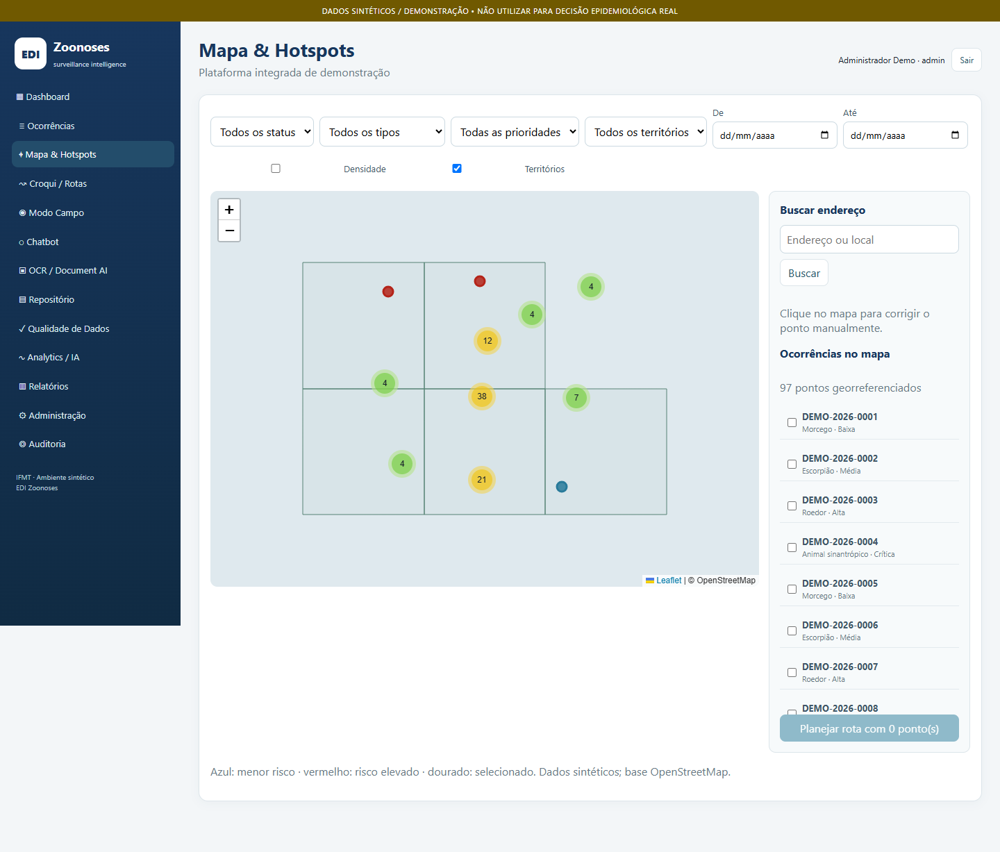
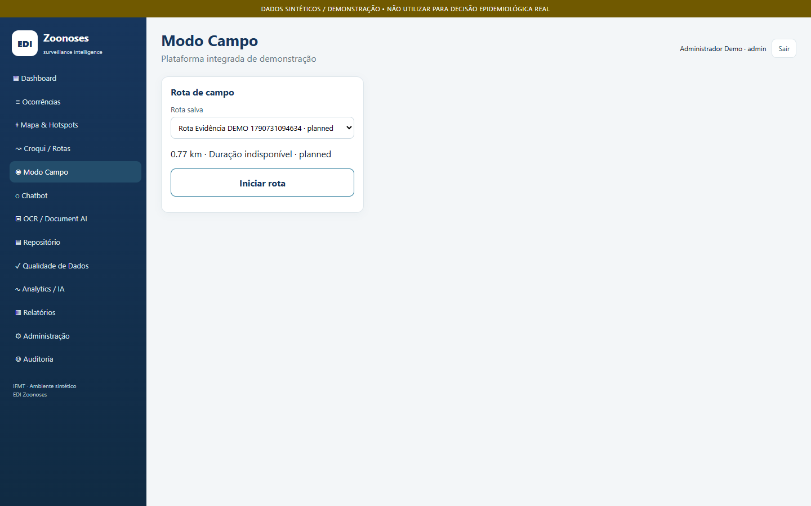
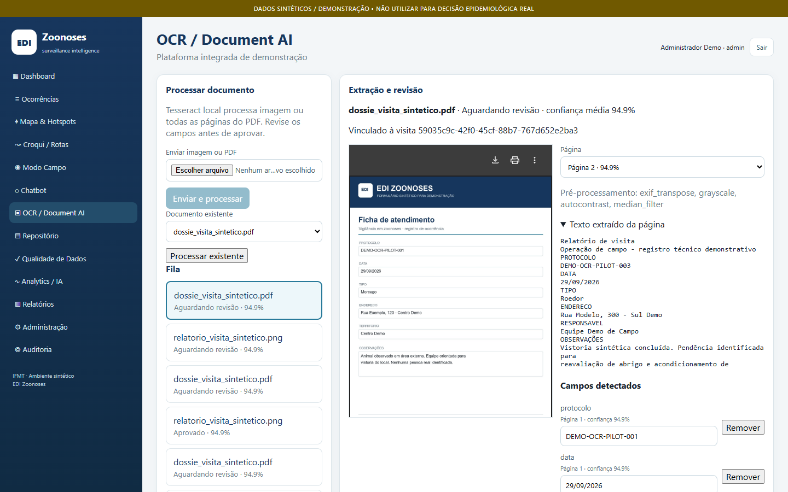

# EDI Zoonoses

**Ecossistema Digital Integrado com Inteligência Artificial para Modernizar a Vigilância em Zoonoses: Gestão Territorial e Análise de Dados**

Aplicação demonstrativa para organizar ocorrências, território, trabalho de campo e documentos em um fluxo único. O **EDI Zoonoses** reúne mapa GIS, planejamento e execução de rotas, geolocalização com geofence, OCR real com revisão humana, repositório eletrônico e indicadores derivados do banco. Funciona localmente com Docker Compose e dados **100% sintéticos**.

> **Ambiente DEMO.** As contas, ocorrências, endereços, documentos e indicadores deste repositório são fictícios. A instalação local não é homologada para dados pessoais, decisões epidemiológicas ou uso institucional em produção.

**Repositório:** [github.com/devfullstackNeto/edizoonoses](https://github.com/devfullstackNeto/edizoonoses)  
**Desenvolvimento:** Carlos Gracioli Neto / IFMT

## Visão do produto

O objetivo é demonstrar como a vigilância em zoonoses pode manter um histórico rastreável desde o registro georreferenciado de uma ocorrência até o planejamento da visita, a coleta de evidência, a digitalização de documentos e a análise operacional. O sistema preserva a decisão humana: OCR e análises são assistivos, e a chegada fora da geofence exige justificativa registrada.

| Mapa GIS e ocorrências | Operação em campo | OCR e revisão |
|---|---|---|
| [](docs/evidence/screenshots/desktop/03_mapa_gis.png) | [](docs/evidence/screenshots/desktop/09_modo_campo.png) | [](docs/evidence/screenshots/desktop/19_ocr_multipagina.png) |

Mais imagens, inclusive do fluxo móvel, estão no [índice de evidências](docs/evidence/EVIDENCE_INDEX.md). As 36 capturas foram produzidas por navegação real com Playwright; o pacote não inclui vídeo válido.

## Funcionalidades e módulos

| Módulo | O que demonstra |
|---|---|
| Acesso e governança | Login DEMO, papéis e autorização no backend, administração e trilha de auditoria. |
| Ocorrências e GIS | CRUD, timeline, mapa Leaflet/OpenStreetMap, geometrias PostGIS, busca de endereço na seed e correção manual de ponto. |
| Croqui e rotas | Seleção de paradas, ponto de partida, ordenação local *nearest-neighbor*, geometria e distâncias; OSRM é opcional. |
| Modo Campo | Rota ativa, próximo destino, check-in explícito, geofence, chegada com override justificado, visita, resultado, pendência e evidência. |
| Documentos e OCR | Upload no MinIO, fila Redis/RQ, Tesseract real em imagem e PDF multipágina, campos extraídos, revisão e aprovação humanas. |
| Repositório eletrônico | Documentos vinculados, metadados, hash, classificação, busca e acesso controlado. |
| Inteligência e gestão | Chatbot com fonte e fallback, qualidade de dados, dashboard derivado do banco, análises demonstrativas, importação/exportação e relatórios. |

O [fluxo móvel de geofence](docs/evidence/screenshots/mobile/05_geofence_mobile.png) foi registrado em viewport 390 × 844 com localização simulada pelo navegador. A operação em celular físico e a câmera não foram homologadas.

## Arquitetura e stack

```text
Navegador (React + TypeScript + Vite + Leaflet)
                 │ REST /api/v1 via Nginx
                 ▼
             FastAPI ───── PostgreSQL + PostGIS
                │  ├───── MinIO (documentos)
                │  └───── Redis/RQ ─── Worker + Tesseract (OCR)
                └──────── Alembic, autenticação, RBAC e auditoria
```

O Docker Compose sobe **seis serviços com healthchecks**: `web`, `api`, `db`, `redis`, `minio` e `worker`. A API usa Python, FastAPI, SQLAlchemy e Alembic; a interface usa React, TypeScript, Vite, Leaflet e OpenStreetMap; o banco usa PostgreSQL/PostGIS. O worker executa OCR assíncrono com Tesseract. [Arquitetura detalhada](ARCHITECTURE.md) · [Modelo de dados](DATA_MODEL.md) · [API](API.md).

## Executar localmente

**Requisito:** Docker Desktop ou Docker Engine com Compose v2. Na raiz do repositório, em PowerShell, Bash ou terminal equivalente:

```sh
docker compose up --build -d
docker compose ps
```

Na primeira inicialização, a API aplica as migrações Alembic e a seed idempotente. Aguarde os seis serviços exibirem `healthy`. Não é necessário criar `.env` para a demonstração local; [.env.example](.env.example) documenta as opções. Se precisar configurar integrações opcionais, copie o exemplo para `.env` local, que é ignorado pelo Git.

| Serviço | Endereço local |
|---|---|
| Interface | [http://localhost:8090](http://localhost:8090) |
| API / OpenAPI | [http://localhost:8010/docs](http://localhost:8010/docs) |
| Prontidão da API | [http://localhost:8010/health/ready](http://localhost:8010/health/ready) |
| Console MinIO | [http://localhost:9001](http://localhost:9001) |

**Contas locais DEMO** — senha comum `Demo@2026`:

| Papel | Usuário |
|---|---|
| Administrador | `admin@demo.local` |
| Campo | `campo@demo.local` |
| Analista | `analista@demo.local` |
| Gestor | `gestor@demo.local` |
| Visualizador | `viewer@demo.local` |

Essas credenciais são públicas e servem apenas à instância local. Para encerrar sem apagar os volumes: `docker compose down`. Consulte [Implantação](DEPLOYMENT.md) antes de qualquer exposição em rede.

## Validação e evidências

O [QA_REPORT.md](QA_REPORT.md) registra a última validação completa da Sprint 3 em 29/09/2026: **17/17 testes de API**, **4/4 E2E Playwright**, **1/1 teste frontend**, lint, typecheck e build sem falhas, seis serviços `healthy` e **zero P0 FAIL conhecido** naquela rodada. A captura posterior de evidências executou **1/1 jornada Playwright**. Esses resultados descrevem as execuções documentadas; publicação no GitHub não constitui nova homologação.

Para repetir as suítes no ambiente local:

```sh
docker compose exec -T api pytest -q
cd apps/web
npm ci
npm test
npm run lint
npm run typecheck
npm run build
npm run e2e
```

O E2E requer o navegador Chromium do Playwright instalado. A captura visual pode ser repetida com `npx playwright test --config=playwright.evidence.config.ts` dentro de `apps/web`; isso cria nova ocorrência e rota sintéticas e substitui as imagens do pacote. Use `python scripts/verify_evidence.py` para conferir as capturas existentes por SHA-256.

- [Índice das 36 evidências visuais válidas](docs/evidence/EVIDENCE_INDEX.md)
- [Relatório de captura e limites](docs/evidence/reports/EVIDENCE_CAPTURE_REPORT.md)
- [Guia de screenshots](SCREENSHOT_GUIDE.md)
- [Rastreabilidade do escopo aprovado](docs/evidence/SUAP_TRACEABILITY.md)

## Estrutura do repositório

```text
apps/api/                 API, migrações, seed, worker, fixtures e testes Python
apps/web/                 Interface React, testes frontend e Playwright
baseline/                 Referência visual e funcional preservada
context/                  Escopo e critérios de aceitação do projeto
docs/evidence/            Screenshots, índice, rastreabilidade e relatório
docs/                     Documentos técnicos e científicos do projeto
reference/                Esquema e OpenAPI de referência
scripts/                  Geração de fixtures e verificação de evidências
docker-compose.yml        Infraestrutura DEMO de seis serviços
```

Documentação complementar: [operação de campo](FIELD_OPERATIONS.md), [pipeline OCR](OCR_PIPELINE.md), [roteiro DEMO](DEMO_SCRIPT.md), [testes](TESTING.md), [segurança](SECURITY.md), [privacidade](PRIVACY.md), [prontidão do piloto](PILOT_READINESS.md) e [histórico de mudanças](CHANGELOG.md).

## Limites, segurança e continuidade

- A seed e as fixtures são sintéticas; os dashboards não representam vigilância real. Dados gerados por testes permanecem nos volumes locais até limpeza deliberada.
- Busca geocodificada usa a base local quando não há serviço externo autorizado. Sem `OSRM_BASE_URL`, a rota usa fallback geométrico local. O chatbot funciona offline com base controlada; um provider externo de IA é opcional.
- Localização e câmera foram demonstradas por navegador/fixture. Testes com usuários, dispositivos físicos, rede de campo, treinamento e implantação institucional ainda exigem validação própria. O pacote possui 36 screenshots válidos e nenhum vídeo válido.
- O Compose usa senhas e segredos DEMO conhecidos. Antes de uma implantação compartilhada, são necessários credenciais próprias, HTTPS, configuração de rede, revisão de RBAC, backup, retenção, política LGPD e homologação institucional. Veja [Segurança](SECURITY.md) e [Privacidade](PRIVACY.md).

**Continuidade:** validar o piloto com usuários e dispositivos reais, definir governança de dados e retenção, configurar infraestrutura e integrações externas autorizadas, e repetir os testes e a avaliação institucional. Essas etapas não são tratadas como entregues por este repositório.
